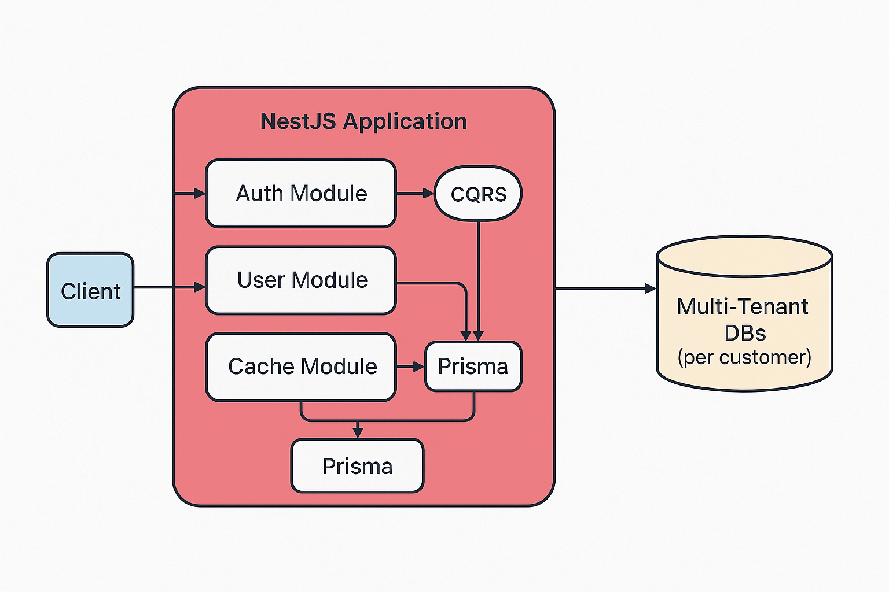

# NestJS 기반 유저 서비스

## 🧩 프로젝트 소개
NestJS 기반 유저 서비스는 SaaS(Software as a Service) 형태를 지원하는 백엔드 애플리케이션으로, 멀티 테넌트 환경에서 사용자 인증과 테넌트 관리 기능을 제공합니다. NestJS의 CQRS 패턴과 DDD 아키텍처를 적용하여 확장성과 유지보수성을 높였으며, Prisma ORM을 통해 MySQL 데이터베이스를 다루고 있습니다. 또한 Redis 캐시, 인 메모리 캐시를 활용하여 성능을 최적화한 것이 특징입니다.NestJS 기반 유저 서비스는 멀티 테넌트 환경을 지원하는 백엔드 애플리케이션으로, 사용자 인증과 테넌트 관리 기능을 제공합니다. NestJS의 CQRS 패턴과 DDD 아키텍처를 적용하여 확장성과 유지보수성을 높였으며, Prisma ORM을 통해 MySQL 데이터베이스를 다루고 있습니다. 또한 Redis 캐시, 인 메모리 캐시를 활용하여 성능을 최적화한 것이 특징입니다.

## 🔨 주요 기술 스택
- **프레임워크**: NestJS (TypeScript)
- **데이터베이스**: PostgreSQL (멀티 테넌트 구조), Prisma ORM
- **패턴**: CQRS, DDD, Clean Architecture
- **캐싱**: In-memory Cache + Redis
- **인증**: JWT, Passport
- **테스트**: Jest
- **DevOps**: Docker (선택적)

## 🚀 설치 및 실행
```bash
# 1. 레포지토리 클론
git clone https://github.com/your-repo/nestjs-user-service.git
cd nestjs-user-service

# 2. 환경변수 설정
cp .env.example .env
# .env 파일에 DATABASE_URL, REDIS_HOST 등 설정

# 3. 패키지 설치
npm install

# 4. Prisma 마이그레이션
npx prisma migrate deploy

# 5. 개발 서버 실행
npm run start:dev
```

## 🧠 핵심 아키텍처 요약
- CQRS 패턴: 명령(Command)과 조회(Query) 책임 분리
- 멀티 테넌시: 테넌트별 별도 DB 생성 및 Prisma Client 캐싱
- 클린 아키텍처: Application, Domain, Infrastructure 계층화
- 의존성 역전: Repository 인터페이스 분리 및 DI
- 캐싱 전략: NestJS Memory Cache + Redis 캐시 병행 사용

## 📦 시스템 구조도


## 📋 주요 기능
- 사용자 인증 (회원가입, 로그인, 토큰 갱신)
- 사용자 관리 (프로필 조회/수정, 사용자 목록, 삭제 등)
- 테넌트 관리 (신규 테넌트 생성, 목록/상세 조회, 삭제)
- 역할/권한 기반 접근 제어
- 데이터 격리 (테넌트별 DB 접근)
- 캐싱 기반 고속 데이터 조회

## 🧪 API 명세 (일부 예시)
| 메소드 | 경로 | 설명 |
|--------|------|------|
| POST | /auth/signup | 회원가입 |
| POST | /auth/login | 로그인 |
| GET | /users/me | 내 정보 조회 |
| GET | /users | (관리자) 사용자 목록 |
| POST | /tenants | (슈퍼관리자) 테넌트 생성 |

## 📘 ERD 개요 (논리적)
```
MasterDB
└── Tenant (id, name, db_url)

TenantDB (per tenant)
└── User (id, email, name, role, ...)
```
> 각 테넌트는 독립된 DB를 사용하며, PrismaClientManager가 요청별 DB 연결을 관리합니다. 또한, 권한 분리가 되어 있어 접근 가능한 API 를 선택적으로 분리 가능합니다.

## 🏗 시스템 아키텍처 다이어그램
```
Client
  ↓
Controller → (Command | Query Handler)
  ↓                     ↓
Domain Service       캐시 레이어 (Memory → Redis)
  ↓                     ↓
Repository (Prisma ORM)
  ↓
Tenant별 DB 연결
```

## 🧪 테스트
```bash
npm run test
```

## ⚙️ 추가 설정
- `.env` 설정 (DATABASE_URL, JWT_SECRET, REDIS 관련)
- Prisma schema, Tenant DB 생성 스크립트 필요 시 별도 제공
- Swagger 또는 Postman으로 API 문서 제공 가능

## 🧱 보완 예정 항목
- [ ] ⏸️ CI/CD 파이프라인 구축 *(작업 보류 중)*
  - GitHub Actions로 lint/test/build 자동화
  - Docker 이미지 빌드 및 도커허브 푸시
  - 환경 분리 배포

- [ ] 🟡 테스트 커버리지 확대 *(예정됨)*
  - 유닛/통합 테스트 강화
  - 커버리지 리포트 CI 통합

- [ ] 🟡 Swagger 기반 API 문서 자동화 *(작업 대기 중)*
  - `@nestjs/swagger` 적용
  - 문서 자동 생성 및 배포

- [ ] ⏸️ Helm Chart 기반 K8s 배포 *(보류됨)*
  - 환경별 `values.yaml` 구성
  - ConfigMap 분리 및 인프라 정의

- [ ] 🚧 이벤트 기반 아키텍처 일부 적용 *(초기 설계 중)*
  - Kafka/Redis PubSub 도입
  - 도메인 이벤트 활용

- [ ] 🟡 Observability 개선 *(계획됨)*
  - Prometheus + Grafana 기반 모니터링
  - 응답 시간, 쿼리 부하, 캐시 적중률 시각화

- [x] ✅ 멀티 테넌시 DB 관리 자동화 *(구현 완료)*
  - 테넌트 생성 시 전용 DB 자동 생성
  - PrismaClient 인스턴스 자동 캐싱 및 마이그레이션 적용

## 🪪 라이선스
MIT License
